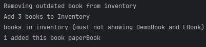

#  Quantum Bookstore

## Project Structure
```
  src/
  ├── model/
  │ ├── Book.java
  │ ├── DemoBook.java
  │ ├── PaperBook.java
  │ ├── EBook.java
  │ ├── Order.java
  │ └── Inventory.java
  ├── service/
  │ ├── BuyService.java
  │ ├── ShippingService.java
  │ └── MailService.java
  ├── AppTest.java
  ├── Main.java
  └── README.md
```
## Tests

### Add book to inventory
- code

  
- output


### Remove book to inventory
- code

  
- output

  

### remove outdated
- code


- output



### buy
* code


* output


